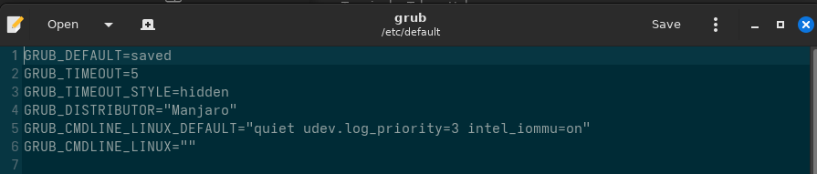

## 检查电脑是否支持以及打开虚拟化功能

通过virt-host-validate命令查看功能是否完整
Warning不一定是错误，可能只是部分功能或者驱动有问题，不是特别影响虚拟机
Error需要留意
### 常见Error
#### iommu没有打开的错误
sudo <编辑器> /etc/default/grub
然后按照格式添加
比如英特尔处理器就
参数之间需要空格，谨慎修改，否则引导内核会失败

#### 没有hypervisor
没安装qemu，安装一下就行

#### 没有启动libvirtd服务
参见安装篇目，检查是否让init系统拉起服务

## 正式开始配置
在有些发行版上，可能不会自动通过socket连接到QEMU/KVM服务，需要右键然后connect
有时候connect会出现
Unable to connect to libvirt qemu:///system.

Verify that an appropriate libvirt daemon is running.
一般就是libvirtd服务没有自动启动，去安装篇找一下服务启动命令即可
### 创建虚拟机

一般来说，如果你已经有一个安装了linux的盘，那么就选这个
（注意，选择块设备，也就是/dev/<磁盘设备文件>，不会自动生成分区表，也就是说，在gparted等磁盘分区软件读取到的数据和分区可能与正常物理机安装linux不同，介意的话请自行物理安装一次再通过图中的方式导入）

在搜索这个框框里面如果找不到要安装的发行版直接选择Generic Linux就好
然后点击Browse...

不需要创建储存池，直接Browse Local

点击Other Location，找到File System（即本机根目录）
进入/dev/，选择物理磁盘设备
资源占用上限只需要不超过设备限制就行
之后会进入这里

这里点finish也许会为你启动NAT，如果没有启动，在控制台输入
sudo virsh net-start default
即可