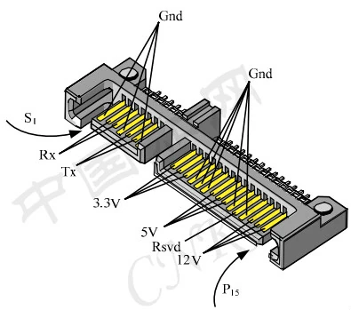
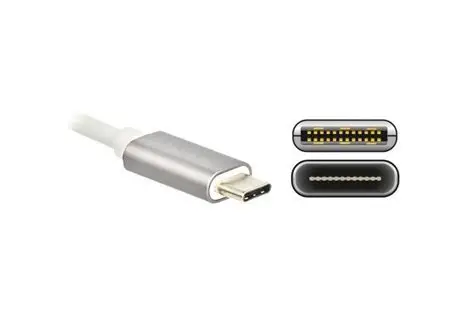
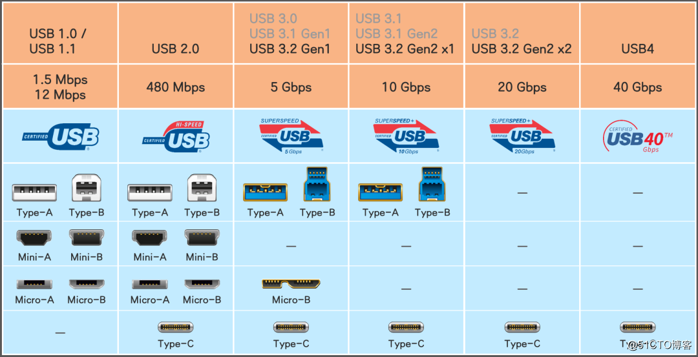
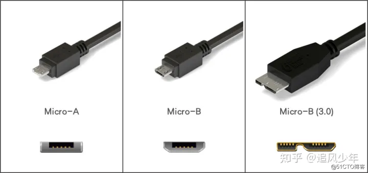

## 典型的计算机硬件接口介绍
### SATA协议
SATA是Serial ATA的缩写，即串行ATA。2000年11月由“Serial ATA Working Group”团体所制定。它是一种电脑总线，主要功能是用作主板和大量存储设备（如硬盘及光盘驱动器）之间的数据传输，由于采用串行（每个信道只对同一个来源的数据包负责）方式传输数据而得名，还具有结构简单、支持热插拔的优点。

SATA总线使用了嵌入式时钟频率信号，具备了比以往更强的纠错能力，能对传输指令（不仅是数据）进行检查，如果发现错误会自动矫正，提高了数据传输的可靠性。SATA和以往最明显的分别，是用上了较细的排线，有利机箱内部的空气流通，增加了整个平台的稳定性。

### USB接口协议
#### USB-C
（其采用的硬接口规范是Type-C，还有其他协议比如雷电 比如Displayport也采用了TypeC硬接口规范所以，你未来将会看到一堆长得一样实际上采用不同协议的TypeC接口）

#### USB-A
建议不要参考颜色，因为我们非常良心的中国厂家往往会造假货，把本应该是1.0 2.0的四个触点白色接口换成四个触点的蓝色接口，对的，实际的金属接触点数量只有四个，远远不如USB3.0 TypeA接口的5个触点

#### USB-micro

## 硬件接口
硬件接口一开始是不规范的，有各种各样的接口，但是就像现在的电器接口分成三插头（接地）和两插头（没有接地）
行业发展逐渐形成了不同的规范

### 硬件接口作用
纯粹的电源接口的作用就是转移能量
那么对于计算机和模拟计算机来说，硬件接口的作用就是传输信息
那么就引出两个问题
#### 如何传输最快最高效
这里包含了两个内容
第一，如何设计硬件层面的传输接口，方便扩展通信方式，以及增大信息传输效率
第二，如何设计传输信息的方式，包括将一个自定义信号转换为传输格式的信号（类似FM调制 解调），以及如何还原

#### 如何不受影响地传输
在这个过程中还要考虑信号干扰损失后还原出来的信号有多少是真实的，还要考虑电路设计的难易度
还有接口需要经常插拔，那么接口怎么设计最稳固，寿命最长

#### 综合设计思路
综合设计包括了
模拟电路
理论力学
数字电路
等三个体系的知识，如果感兴趣可以找课程看

于是人们就设计了一套一套的硬件规范，来指导信号转换和发送的方式
### 硬件接口的规范内容
计算机或者模拟电路的规范接口一般需要包含以下的内容
#### 硬件方面

| 主要方面 | 考虑的相关内容                                                                       |
| ---- | ----------------------------------------------------------------------------- |
| 接口样式 | 干扰  力学寿命  有多少个信道可以传输                                                          |
| 传输格式 | 工作模式：如何复用单个信道，比如说一次性发送多个信息，比如说数字电路里面的周期性信号设计（如何让设备在单个信道内互相都能发送信息，而不是只有一方可以发送） |
| 转换方式 | 主要是芯片电路如何设计等等（包括一些可扩展规范，比如说抗干扰，因为抗干扰的电路越多成本越高，奸商看到你这个成本高就不会采用这个标准）            |
#### 软件方面

| 主要方面 | 考虑内容                                               |
| ---- | -------------------------------------------------- |
| 驱动   | 怎么设计函数方便开发者调用，怎么兼容以后的标准，放不方便以后更改了传输格式之后还能保证api不变等等 |
